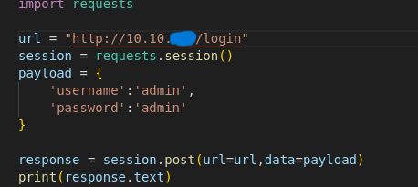

# capture [Try hack me](https://tryhackme.com/r/room/capture) 

## **Task**: Bypassing login

> To begin with,  this is my first bypass using python script 😂
> I would be going through the steps used to bypass the login page

### Investigation

I don't have any idea about the site I would be hacking, I was just provided with an ip `10.10.*.*` address to the site and i was provided a list of passwords and usernames to use to by pass the page. Below are the steps for my investigation

- **Inpect Login Page**

First off I open the `ip` in my browser   I see that the login page is a simple HTML page with a form that accepts username and password. Now i try with a fake credential to see if I can pypass it.  It returns error messages right below the button.
`<strong>Error:</strong> The user &#39;admin&#39; does not exist`. That's great!!!.
*Now what to do next ?*
Let investigate the page source code 

### Creating python script to brute force

Now that I now how the source code looks like, I would write a python script to try to bypass the login.

- **Try with default payload to see response:**
    Upon investigation, I noticed the form fields are `username` and `password` so I will use that in the request payload to make my initial request.
    
    
- **now I will brute force with the usernames provided**:
  - *Initial trial* 

      From the code, I loaded the usernames in the form of an array and loop over it while making requests to the url and printing out the results.
      

      Ooops captcha!!! Another error `
<strong>Error:</strong> Invalid captcha`  

  - *Solving the capture:* Now we would try solving the capture by utilizing regular expressions (*regex*)
    

    From the code, I have implemented a capture solving fuction utilizing the module `rs`. So now capture is resolved as we can see. Now I notice anytime there is an unsuccessful login, there is an error string in the response so after solving a problem I try capturing othere errors in the response and behold we have a `username`.
    

  - *Brute force password:* Now that I have a username, I try to brute force the password against the username I have found.
    
    Boom!!!

    

### **Test results**

Now that i have a username and password, let use it on the login page

### **Conclusion**

I'm trying other approaches to solve this CTF. I will update the repo with other solutions.
